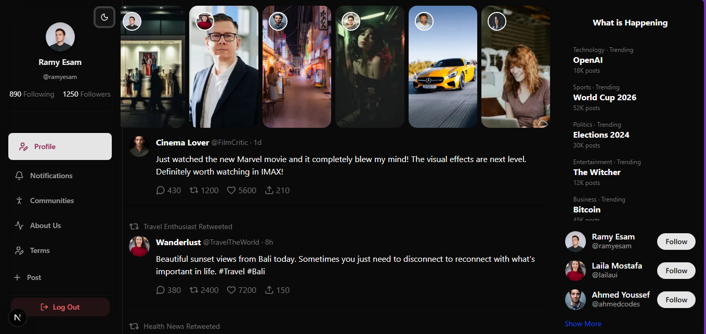
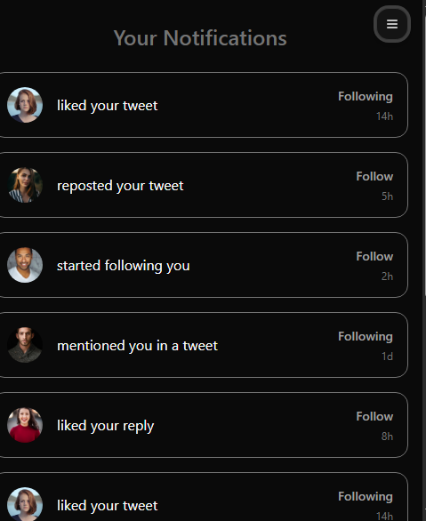
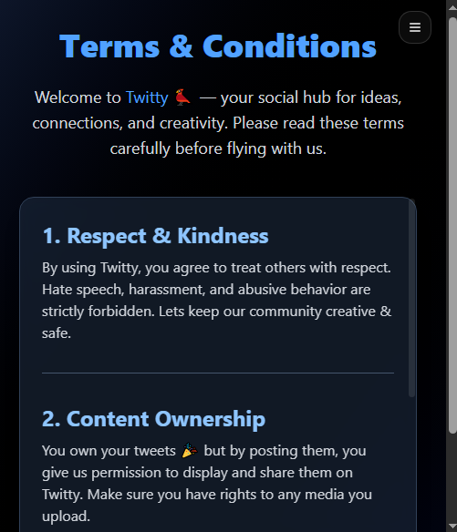
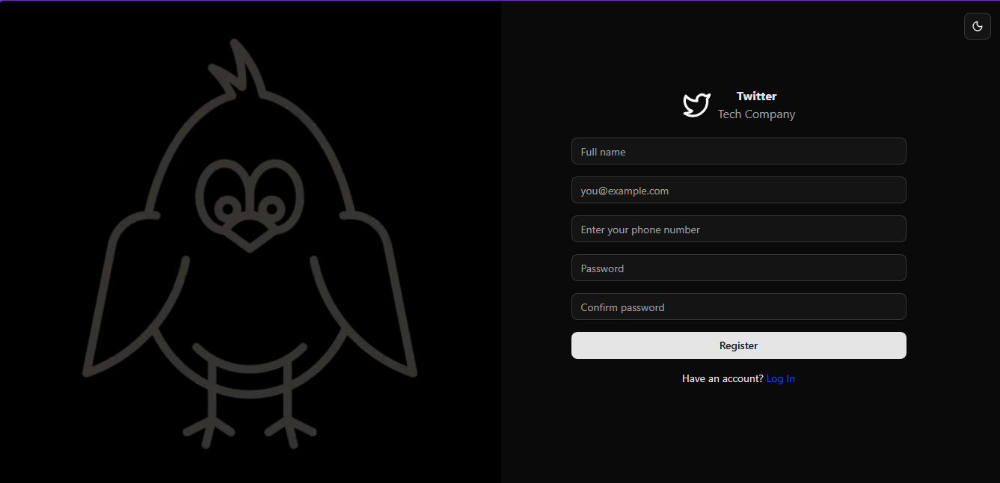

# 🐦 Twitty – Twitter Clone

Twitty is a **modern Twitter clone** built with **Next.js 15**, **Tailwind CSS**,**Shadcn** and **Framer Motion**.  
It replicates Twitter's core functionality with a responsive UI, smooth animations, and production-ready deployment on **Vercel**.

---

## ✨ Features
- 🔐 **Authentication** – secure login & register
- 🐤 **Post Tweets** with text, images, and emojis
- ❤️ **Like, Comment & Retweet** interactions
- 🔄 **Infinite Scroll & Real-time Feed**
- 👤 **User Profiles** with bio, avatar, and cover photo
- 🔔 **Notifications system**
- 🌙 **Dark Mode** support
- 🎨 **Smooth Animations** with Framer Motion
- 🚀 **Optimized for Vercel deployment**

---

## 📸 Screenshots







---

## 🛠 Tech Stack
- [Next.js 15](https://nextjs.org/) – React framework with App Router
- [React 19](https://react.dev/) – UI library
- [Tailwind CSS](https://tailwindcss.com/) – Utility-first styling
- [Framer Motion](https://www.framer.com/motion/) – Animations
- [Shadcn/UI](https://ui.shadcn.com/) – Reusable UI components
- [Vercel](https://vercel.com/) – Hosting & CI/CD
- [React Hook Form](https://react-hook-form.com/) & [Zod](https://zod.dev/) – Form handling & validation


## Lighthouse Report

⚡ Performance: 92+
♿ Accessibility: 90+
🔍 SEO: 90+
✅ Best Practices: 90+


## 🔗 Links

- **Live Demo (Vercel)** 👉(twitty-x.vercel.app)  
- **GitHub Repository** 👉 (https://github.com/Ramy29/Twitty)

## 🚀 Getting Started

```bash
git clone https://github.com/Ramy29/Twitty.git
cd Twitty
npm install
npm run dev

